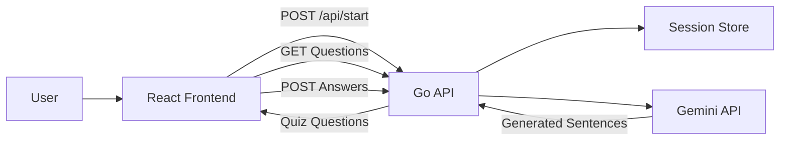
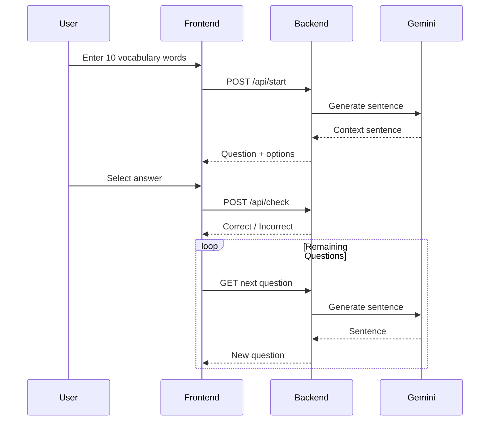

# StudyBuddy-ai

An AI-powered vocabulary learning application built with **Go**, **React**, and **Google Gemini**.

StudyBuddy helps students reinforce vocabulary through dynamically generated multiple-choice quizzes. Users provide a custom list of vocabulary words, and the application generates contextual sentences using Gemini AI, creating an interactive fill-in-the-blank learning experience.

---

## Features

* Generate vocabulary quizzes from a custom word bank
* AI-generated contextual sentences using Gemini
* Multiple-choice answer validation
* Session-based quiz tracking
* Single-word and two-word challenge questions
* React frontend with responsive UI
* Go backend REST API using Gin
* Dockerized deployment with Nginx reverse proxy

---

## Tech Stack

### Backend

* Go
* Gin Web Framework
* Cookie-based Session Management
* Google Gemini API

### Frontend

* React
* Vite
* Axios

### Infrastructure

* Docker
* Docker Compose
* Nginx

---

## Architecture



---

## Technical Highlights

### AI Integration

- Integrated Google Gemini API to generate contextual vocabulary questions dynamically
- Designed prompt generation and response parsing workflows
- Managed external API communication and error handling

### Session-Based Quiz State

- Implemented cookie-based session management in Go
- Maintained quiz progress across multiple requests
- Stored user state without requiring authentication

### Backend API Design

- Built RESTful endpoints using the Gin framework
- Separated handlers, models, and business logic into distinct layers
- Implemented JSON request/response patterns for frontend integration

### Containerized Deployment

- Dockerized frontend and backend services
- Configured Nginx as a reverse proxy
- Orchestrated multi-container deployment with Docker Compose

### Frontend-Backend Communication

- React frontend communicates with Go API through Axios
- Managed asynchronous quiz workflows and state updates
- Implemented dynamic question loading and answer validation

---

## Quiz Flow



---

## Project Structure

```text
StudyBuddy-ai/
│
├── backend/
│   ├── main.go
│   ├── handlers.go
│   ├── models.go
│   ├── question.go
│   ├── quiz.go
│   └── sentence_generator.go
│
├── frontend/
│   ├── src/
│   ├── package.json
│   └── vite.config.js
│
├── Dockerfile
├── docker-compose.yml
├── nginx.conf
└── README.md
```

---

## API Endpoints

### Start Quiz

```http
POST /api/start
```

Request:

```json
{
  "words": [
    "analyze",
    "concept",
    "infer",
    "justify",
    "context",
    "evaluate",
    "synthesize",
    "compare",
    "contrast",
    "evidence"
  ]
}
```

---

### Get Question

```http
GET /api/question/{index}
```

Returns a generated fill-in-the-blank question and answer choices.

---

### Check Answer

```http
POST /api/check
```

Request:

```json
{
  "questionIndex": 0,
  "selectedIndex": 2
}
```

---

### Restart Quiz

```http
POST /api/restart
```

Resets quiz progress while maintaining session state.

---

## Running Locally

### Prerequisites

* Go 1.23+
* Node.js
* Docker
* Google Gemini API Key

### Environment Variable

```bash
export SECRET_KEY=YOUR_GEMINI_API_KEY
```

### Run Backend

```bash
go run ./backend
```

### Run Frontend

```bash
cd frontend

npm install

npm run dev
```

---

## Docker Deployment

Build and start all services:

```bash
docker compose up --build
```

Application:

```text
http://localhost
```

---

## Learning Objectives

This project was built to practice:

* REST API design in Go
* Session management
* Integrating external AI services
* Frontend/backend communication
* Dockerized application deployment
* Dynamic content generation
* Application architecture and state management

---

## Future Improvements

* User authentication
* Persistent database storage
* Quiz history and analytics
* Difficulty levels
* Spaced repetition learning
* Teacher dashboards
* Progress tracking
* Cached AI responses to reduce API calls

---

## Author

Daniel Alford

Backend-focused developer building projects with Go, APIs, PostgreSQL, Docker, and cloud-native technologies.

